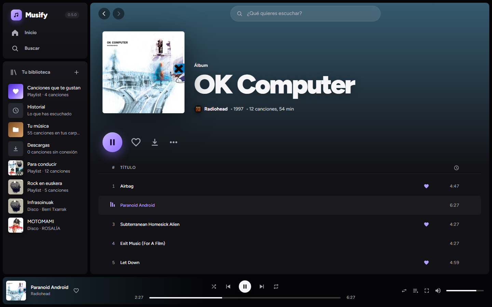
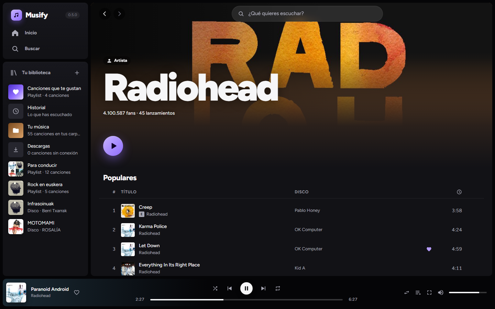
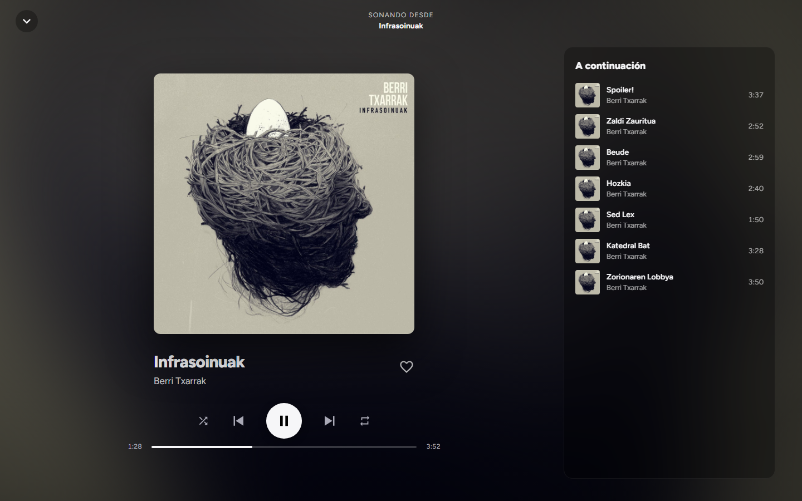
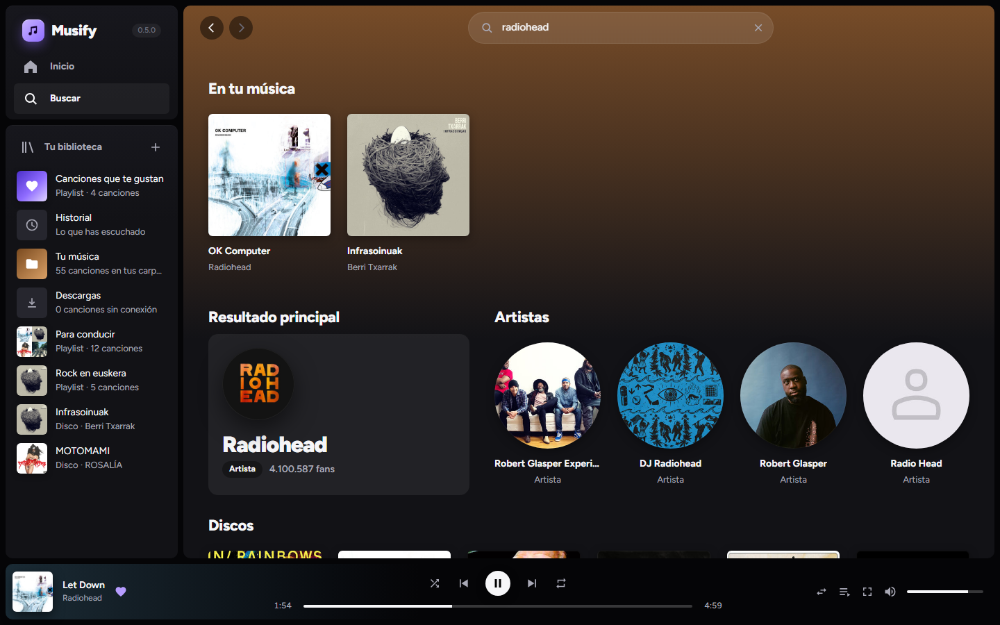
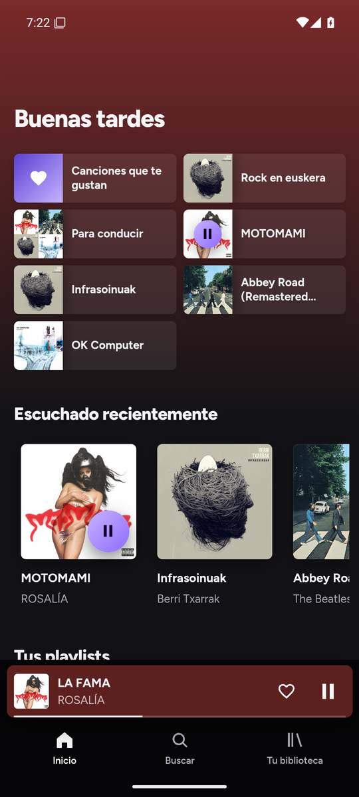

# Musify

Reproductor de música personal tipo Spotify para **Windows, Mac, Linux y Android**. Buscas un grupo, eliges un disco y suena: cada canción se reproduce en streaming de solo audio desde YouTube Music, sin anuncios. Biblioteca, playlists, historial y cola tipo DJ; en el PC, además, descargas para escuchar sin conexión y tu propia música.

| | |
|---|---|
|  |  |
| **Disco:** la portada tiñe toda la pantalla | **Artista:** foto de cabecera y sus canciones más escuchadas |
|  |  |
| **Sonando ahora:** pantalla completa con la cola | **Buscar:** artistas y discos de Deezer |

## En el móvil

La misma app, pensada para el dedo. La música sigue sonando con la pantalla apagada y se maneja desde la pantalla de bloqueo, la notificación y los auriculares.

<table>
  <tr>
    <td></td>
    <td></td>
    <td></td>
  </tr>
  <tr>
    <td><b>Inicio</b>, con lo que suena abajo</td>
    <td><b>Sonando ahora</b>: se cierra deslizando hacia abajo</td>
    <td><b>Cola</b>: tu cola se ordena arrastrando el asa</td>
  </tr>
  <tr>
    <td></td>
    <td></td>
    <td></td>
  </tr>
  <tr>
    <td><b>Disco</b></td>
    <td><b>Tu biblioteca</b>: playlists y discos guardados</td>
    <td><b>Pantalla de bloqueo</b>: sigue sonando con la pantalla apagada</td>
  </tr>
</table>

## Instalar

Descarga el archivo de tu sistema desde la [última versión](https://github.com/diad87/musify-releases/releases/latest):

| Sistema | Archivo |
|---|---|
| Windows 10/11 | `Musify_x.y.z_x64-setup.exe` — doble clic |
| Mac (chip de Apple o Intel, macOS 11+) | `Musify_x.y.z_universal.dmg` — arrastrar a Aplicaciones |
| Linux (64 bits) | `Musify_x.y.z_amd64.AppImage` (cualquier distribución) o `.deb` (Ubuntu/Debian) |
| Android 7 o superior (64 bits) | `Musify_x.y.z_android.apk` — mejor con Obtainium (abajo), para que se actualice sola |

Los instaladores de escritorio no están firmados por Microsoft ni Apple, así que la primera vez el sistema avisa. En la página de cada versión se explica cómo abrirla.

### Android, con Obtainium

Musify no está en Google Play. [Obtainium](https://github.com/ImranR98/Obtainium) instala el APK desde aquí y lo actualiza cuando sale una versión nueva:

1. Instala Obtainium (desde su GitHub o desde F-Droid).
2. En Obtainium, «Añadir app», pega `https://github.com/diad87/musify-releases` y pulsa «Añadir».
3. Pulsa «Instalar». La primera vez, Android pide permiso para instalar apps desde Obtainium.

Si tenías una versión de prueba anterior a la 0.5.0, desinstálala antes: iba firmada con otra clave.

## Se actualiza sola

En el PC (desde la 0.2.0), Musify busca versiones nuevas al arrancar y cada pocas horas, las descarga en segundo plano y las instala al cerrarse. En Linux, las actualizaciones automáticas funcionan con el AppImage.

En Android, Obtainium avisa de cada versión nueva y la instala encima sin perder la biblioteca. La app también lo dice en «Tu biblioteca».

Todas las versiones van firmadas: la app de escritorio no instala nada que no lleve nuestra firma, y Android no deja instalar encima un APK firmado por otro.

---

Uso personal. El código fuente está en un repositorio privado; aquí solo se publican las versiones.
